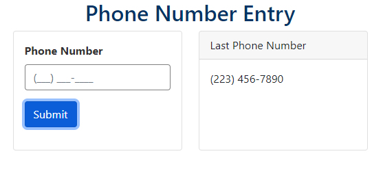

# Phone-Number-Entry

## Description

This site was designed for a job interview. There were a number of requirements that I had not experienced in the past and required a great deal of research. The placeholder text requirement was definitely a challenge. Overall, this was a fun project that I enjoyed working on and I really liked how the final product turned out.
* Estimated Hours: 10-12
* Actual Hours: 16 

## Built With
* HTML
* CSS
* JavaScript

## Project Requirements
1)	The title of the form is “Phone Number Entry.”
2)	The title should be colored #036, centered, and should not wrap at any generally supported breakpoints for desktop or mobile.
3)	The form has a single input. The input label is “Contact Number.”
4)	The label and text entry color should be #333; the input border is #808080.
5)	The placeholder is (\_\_\_) \_\_\_-____ and should be visible as the user is typing into the form: example (2__) \___-____.
6)	The displayed format for the completed phone number is (234) 567-8901.
7)	We want to successfully “validate” the phone number under the following rules: the phone number does not start with a 0 or 1, is only digits, and is 10 digits long. All other entries are not successfully “validated.”
8)	Successful validations apply a green box shadow to the input. Unsuccessful validations apply a red box shadow to the input.
9)	The field should be re-populated with some value on load.
10)	On submit, the phone number displayed should be the successfully validated entry the user inputs.
11)	We want to re-use generic styling and JavaScript functionality elsewhere in the system.
12)	JavaScript or jQuery base solution. Use of Bootstrap 4 is allowed. No other external libraries are currently supported.

## Additional Requirements
There is an additional requirement. We will be saving the phone number into a database for users. We will only save the phone number as digits. Assume that work has been completed and you have access to just the 10-digit phone number. 
Write a simple Java method that returns the phone number in the completed format: (234) 567-8901
1)	We don’t know if the user’s phone number has been entered before, so we don’t know if the value is null. We can’t format null.
2)	We don’t know if the user’s phone number is the required number of digits. We can’t format anything shorter or longer.
3)	We want to re-use the above functionality for other phone number entry fields.

## Site Location
[Phone Number Entry](https://russtracy.github.io/Phone-Number-Entry/)

## Contribution
Made by [Russ Tracy]

## Site Image

### ©️2020 Russ Tracy
